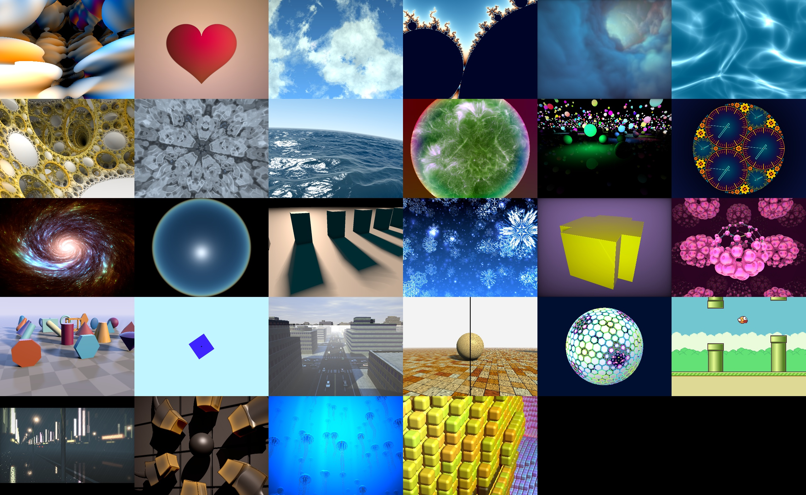

# [shadertoy.com] shaders ported to [Rust-GPU]

## How to run

Run `cargo run --release` and a window will pop up with 28 different animations
in it. (Two squares on the bottom right-hand side are empty.) That's it!

## License

[Rust-GPU] is dual-licensed under [Apache-2.0/MIT](https://github.com/EmbarkStudios/rust-gpu/#license)

Individual shaders are licensed according to the original [shadertoy.com] entry  
(see each file's documentation comment for more details).

[shadertoy.com]: https://shadertoy.com
[Rust-GPU]: https://github.com/rust-gpu/rust-gpu
